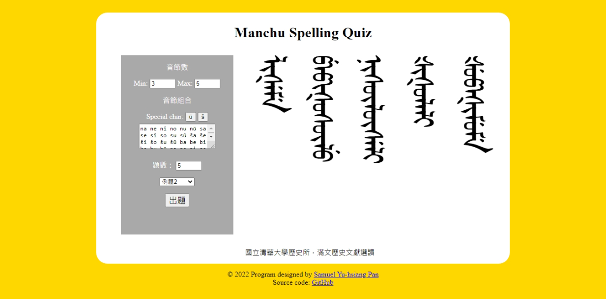

# Manchu Spelling Quiz
> https://syhpan.github.io/toolbox/manchu/

## 使用說明
### Step 1
進入頁面後，依欄位說明輸入所需內容：
- 音節數：輸入生成題目之音節數上下限（Min & Max），如：`Min: 3`、`Max: 5`。
- 音節組合：輸入欲作為題目範圍之音節組合，並以空格（空白鍵）分隔各音節，如：
```
man ju gi sun
```
即以上列輸入之音節組合生成題目內容。
- 題數：輸入欲產生之題目數量。
- 選擇例題：可選擇提供的例題進行出題。

### Step 2
點選「出題」按鈕，即可產生題目，並顯示於頁面右方。

## 網站預覽



