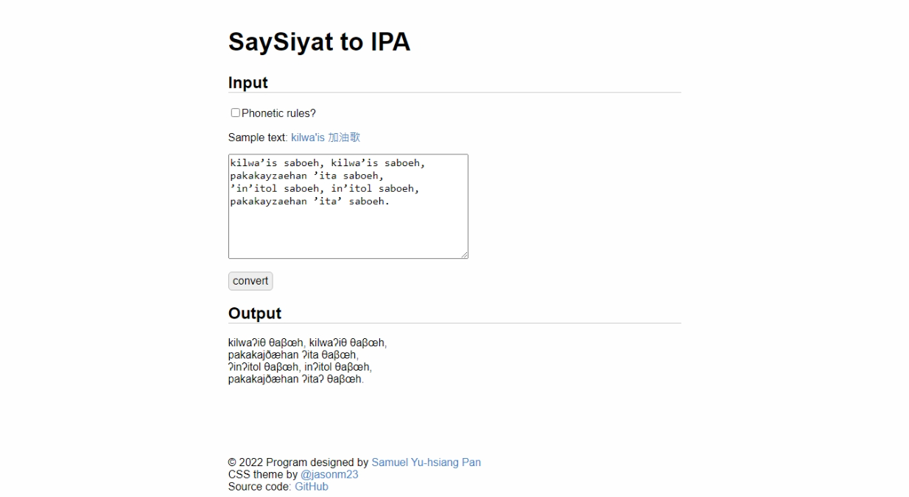

# SaySiyat to IPA
> https://syhpan.github.io/toolbox/say2ipa/

## 使用說明

本程式可將賽夏語文本轉換為國際音標(IPA)。

### Step 1
進入頁面後，依欄位說明選擇或輸入所需之內容：
- Phonetic rules：勾選決定是否套用語音規則，如：顎化、長元音等（較少用）。
- Sample text：本程式提供之轉換範例，點選後即產生於文字框中。
- Input：於文字框輸入所需轉換之文本，如：
```
So'o kayzaeh ay
```

### Step 2
點選「convert」按鈕，即可轉換，並將輸出結果顯示於頁面下方，如：
```
ʃoʔo kajðæh aj
```

## 網站預覽
